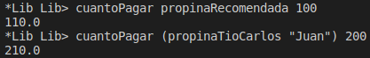

# Propinas

Enunciado: https://docs.google.com/document/d/12K2_fChev2MrMZXz358RXGljA5iEejJn_D_bBU6B7sE/edit

a. ¿Cuánto debería pagar una persona que paga la propina recomendada si su plato salió $100?
b. ¿Cuánto pagaría mi Tío Carlos, si el mozo se llama Juan y su plato salió $200?
Respuestas:

c. ¿Qué concepto aparece en la consulta del punto b. que no aparece en el punto a?
Respuesta: 
En el punto b aparece el concepto de aplicación parcial. Para saber cuánto pagaría el Tío Carlos, necesito un parámetro extra: el mozo. Para eso, aplico parcialmente (propinaTioCarlos "Juan") en este ejemplo.

Estado de los tests:

